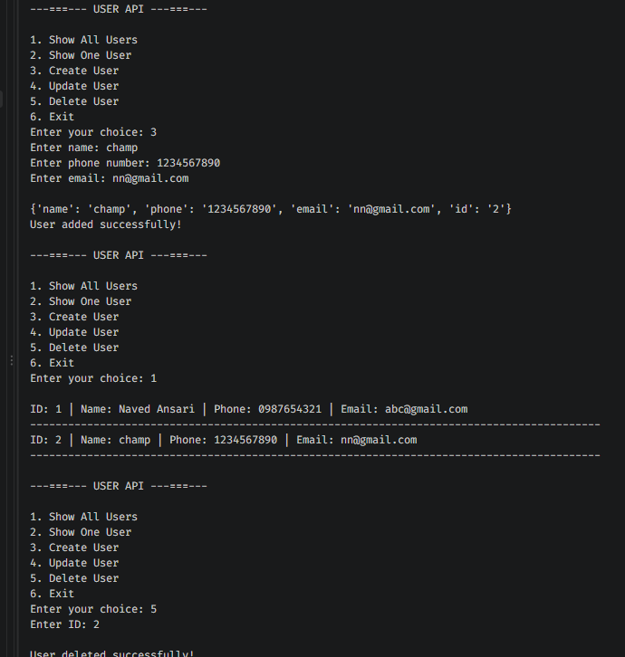

# User API CLI

A command-line CRUD application built with **Python**, **Requests**, and **MockAPI**.

This project was created to practice working with REST APIs, HTTP methods, JSON data, input validation, exception handling, and CRUD operations from a Python command-line application.

## 🚀 Features

* View all users
* View a single user by ID
* Create a new user
* Update an existing user
* Delete a user
* Input validation
* API request timeout handling
* Connection error handling
* HTTP error handling
* Environment variable configuration
* Interactive command-line menu

## 🛠️ Technologies Used

* Python
* Requests
* python-dotenv
* REST API
* MockAPI
* JSON
* Git & GitHub

## 📁 Project Structure

```text
user-api-cli/
│
├── app.py
├── validation.py
├── README.md
├── requirements.txt
├── .gitignore
└── screenshots/
```

### `app.py`

Contains the main application logic and API CRUD operations:

* GET all users
* GET one user
* POST user
* PUT user
* DELETE user
* Main menu

### `validation.py`

Contains reusable input-validation functions:

* User ID validation
* Name validation
* Phone validation
* Email validation
* API error handling

## 🔗 API Endpoints

The project uses a MockAPI REST API.

| Method | Endpoint      | Description   |
| ------ | ------------- | ------------- |
| GET    | `/users`      | Get all users |
| GET    | `/users/{id}` | Get one user  |
| POST   | `/users`      | Create a user |
| PUT    | `/users/{id}` | Update a user |
| DELETE | `/users/{id}` | Delete a user |

## ⚙️ Installation

### 1. Clone the repository

```bash
git clone https://github.com/naved2001/user-api-cli

### 2. Open the project

```bash
cd user-api-cli
```

### 3. Create a virtual environment

Windows:

```powershell
python -m venv venv
```

### 4. Activate the virtual environment

PowerShell:

```powershell
venv\Scripts\Activate.ps1
```

Command Prompt:

```cmd
venv\Scripts\activate
```

### 5. Install dependencies

```powershell
pip install -r requirements.txt
```

## 🔐 Environment Variables

Create a `.env` file in the project root.

```env
API_KEY=your_mockapi_project_id
```

Do not upload `.env` to GitHub.


## ▶️ Run the Application

```powershell
python app.py
```

You will see:

```text
---===--- USER API ---===---

1. Show All Users
2. Show One User
3. Create User
4. Update User
5. Delete User
6. Exit

Enter your choice:
```

## 💻 Application Operations

### 1. Show All Users

Displays all users stored in the MockAPI endpoint.

```text
ID: 1 | Name: Mohammad Naved | Phone: 9876543210 | Email: naved@example.com
```

### 2. Show One User

Enter a user ID to retrieve a specific user.

```text
Enter ID: 1

ID: 1
Name: Mohammad Naved
Phone: 9876543210
Email: naved@example.com
```

### 3. Create User

The application asks for:

* Name
* Phone number
* Email

The information is sent to MockAPI using a POST request.

### 4. Update User

The application checks whether the user exists and then sends updated information using a PUT request.

### 5. Delete User

The application checks whether the user exists and then removes the user using a DELETE request.

## 🧠 What I Learned

Through this project, I practiced:

* Python functions
* Input validation
* Loops and conditional statements
* Dictionaries
* Exception handling
* Environment variables
* HTTP requests
* REST API concepts
* JSON data
* CRUD operations
* GET, POST, PUT, and DELETE methods
* Request timeouts
* HTTP status codes
* Separating validation logic from application logic

## 🔄 CRUD Operations

```text
CREATE  → POST
READ    → GET
UPDATE  → PUT
DELETE  → DELETE
```

## 🛡️ Error Handling

The application handles common request errors including:

* Request timeout
* Connection failure
* HTTP errors
* General request errors

## 📸 Screenshots

### Menu



## ⚠️ Note

This project uses MockAPI as a mock backend for learning and development purposes.

The application demonstrates how a Python client communicates with a REST API. It is not intended to be a production user-management system.

## 👨‍💻 Author

**Mohammad Naved**

Full Stack Web Developer

* GitHub: `naved2001`
* LinkedIn: `mohammad-naved-ansari`

## ⭐ Future Improvements

Possible future improvements:

* Add search functionality
* Add pagination
* Improve email validation
* Add logging
* Add unit tests
* Add API service layer
* Add authentication
* Add configuration management
* Convert the CLI application into a Django/REST backend
* Build a React frontend for the API

---

If you find this project useful for learning, feel free to explore the code and experiment with the API.
